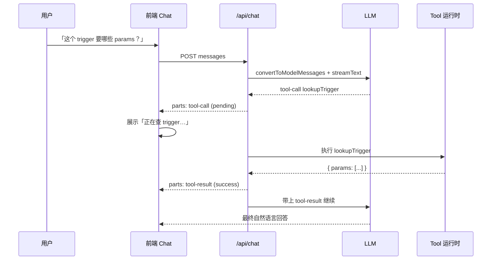

# 阶段 0：Agent 概念笔记

> 按 `工程师学习.md` §4.3 模板填写。用自己的话写，不要大段粘贴译文。

## 1. LLM vs Tool vs Agent Loop

- LLM 单独能做什么（根据上下文生成文本）
  - 改写通知、翻译 locale、归纳 trigger 说明、猜占位符是否齐全
  - 看不到真实配置、调不了接口、改不了订单状态
  - 输入可能编造字段名或漏掉必填变量
- Tool 解决什么（把“模型不会 / 不该假装知道”的事交给确定性代码）
  - 查 mock 的 trigger 定义、校验 business_params、扫{{变量}}、按模板拼预览
  - Tool 有 schema（Zod），入参可校验、失败可返回错误字符串，模型再据此改口，而不是瞎编
- Agent Loop（对照 Cursor）：
  - 用户一句话 → 模型决定要不要用工具 → 发出 tool-call（工具名 + 参数） → 运行时执行 → 把 tool-result 写回
    消息 → 模型带着结果继续想 → 可能再调工具，知道给出最终回复
  - CUrsor 里就是：你提问 → 模型 Read/Grep → 你看到工具卡片 → 结果进上下文 → 模型再写代码
  - 若没有 tool-result，模型等于“喊了工具但没有拿到回执”，loop 断掉

要点：生成文本≠执行工具。模型只负责“叫什么、参数是什么”，真正查库 / 校验的是代码

## 2. 前端为什么要处理 tool-call / tool-result

- **tool-call**：模型决定调哪个工具、参数是什么（UI 要展示 pending / 参数流式到达）
- **tool-result**：工具执行结果，必须回传给模型，否则对话 loop 断掉
- UI 上要区分：`input-streaming` → `input-available` → `output-available` / `output-error`

- 不回传 tool-result：模型不知道查没查到，会重复调用或胡编
- 不展示 pending/success/error：运营会以为“卡住了”或“已经发出去了”
- 写操作还要 HITL：tool-call 先停在确认卡，人点同意后再执行、再回 result

## 3. 当前业务：Agent vs 运营表单 / 审核流

### 适合 Agent（辅助层）

- 起草通知 / 邮件文案、中英 locale 对齐、语气改写
- 对照 trigger 说明，检查 business_params 是否缺字段
- 扫描{{userName}}等占位符是否与模板一致
- 用 mock 数据做预览卡（Generative UI）
- 自然语言问：“某 trigger 需要哪些 business_params？”

这些是建议与草稿，错了可以再改，不直接该生产状态

### 必须留在表单 / 审核流（执行层）

- 审核通过 / 驳回、填写法定驳回原因（谁点的、何时、原因进审计）
- 改订单 / 用户状态（权限 + 状态机，不能靠模型“说一声”）
- 真正发邮件 / 推通知（渠道、频控、失败重试在后端）
- `email_template` 硬约束：驳回必须含原因、不把签到码等敏感信息写进错误模板

### 业务例子（验收用）

运营说：帮我写一条赏金活动驳回通知

- Agent：根据 mock 模板起草正文、标出必须出现的“驳回原因”槽位、出预览
- 人：在审核表单里填真实原因、点驳回
- 后端：改状态、按模板发信

Agent 没有替人点驳回，也没有自己调发送接口

### 一句话边界

Agent 止于草稿与预览；人确认后仍走 B 端表单与 API

---

## 4. 阅读打卡

- [ ] Anthropic《构建有效的 Agent》
- [ ] OpenAI 函数调用
- [ ] MCP 通识（任选一篇）
- [ ] MCP vs Function Calling

口头版

- LLM只会写字
- Tool负责查和算
- 两者用 tool-call / tool-result 转圈才是 Agent
- 前端要把这和一圈画成卡片状态，并把结果送回模型
- 通知工作台里 Agent 当副驾，审核和发送仍走原来的表单
