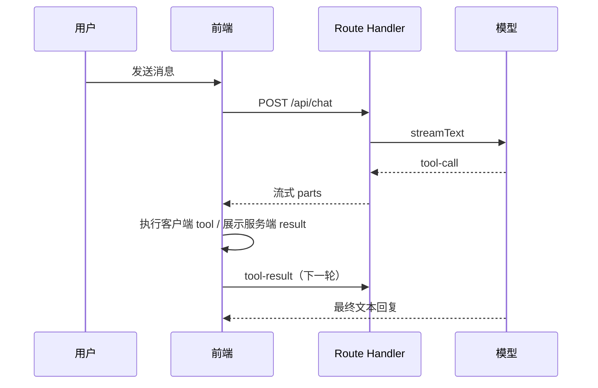

# 阶段 0：Agent 概念笔记

> 按 `工程师学习.md` §4.3 模板填写。用自己的话写，不要大段粘贴译文。

## 1. LLM vs Tool vs Agent Loop

- LLM 单独能做什么：
  - （待填写：例如根据上下文生成自然语言、归纳、翻译）
- Tool 解决什么：
  - （待填写：例如查数据、校验字段、调外部 API）
- Agent Loop（对照 Cursor）：
  - 用户消息 → 模型 → tool-call → 执行 → tool-result → 模型继续 → …

## 2. 前端为什么要处理 tool-call / tool-result

- **tool-call**：模型决定调哪个工具、参数是什么（UI 要展示 pending / 参数流式到达）
- **tool-result**：工具执行结果，必须回传给模型，否则对话 loop 断掉
- UI 上要区分：`input-streaming` → `input-available` → `output-available` / `output-error`

## 3. 当前业务：Agent vs 运营表单 / 审核流

### 适合 Agent（辅助层）

- 通知文案起草、字段校验、多语言对齐
- 邮件 `{{变量}}` 占位符检查、预览
- 自然语言问「某 trigger 需要哪些 business_params」

### 必须留在表单 / 审核流（执行层）

- 审核通过/驳回、填写法定驳回原因
- 改订单/用户状态、真正发邮件/推通知
- `email_template` 硬约束（驳回必须含原因等）

### 一句话边界

Agent 止于草稿与预览；人确认后仍走 B 端表单与 API。

---

## 4. 阅读打卡

- [ ] Anthropic《构建有效的 Agent》
- [ ] OpenAI 函数调用
- [ ] MCP 通识（任选一篇）
- [ ] MCP vs Function Calling
